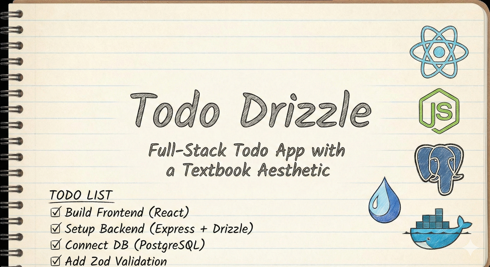

# Todo Drizzle

A full-stack Todo application built with a modern tech stack.

  

## Tech Stack

### Frontend
- **React**: UI library for building the interface.
- **Tailwind CSS 4**: Utility-first CSS framework for styling.
- **Vite**: Fast build tool and development server.
- **Kalam Font**: Handwritten style font for a "Textbook" aesthetic.
- **Axios**: HTTP client for API requests.

### Backend
- **Node.js & Express 5**: Modern web server framework.
- **Drizzle ORM**: Type-safe ORM for PostgreSQL.
- **PostgreSQL**: Relational database.
- **Zod**: Schema validation.
- **Docker**: Containerization for the database.

## Features
- Textbook/Notebook styled UI.
- Create, Read, Update, Delete (CRUD) todos.
- Filter by status (All, Pending, Completed).
- Search functionality.
- Responsive design.
